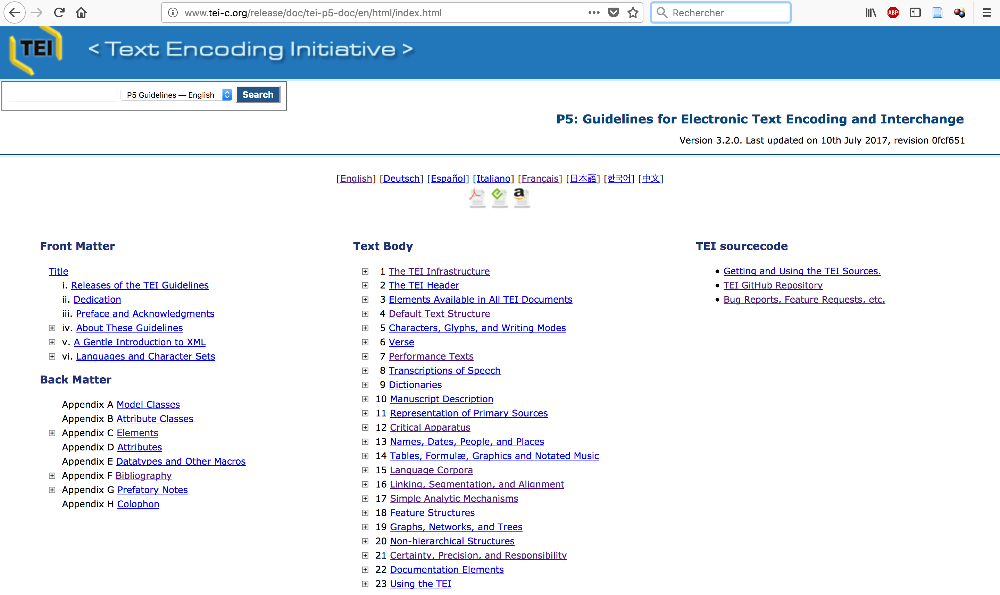

# séance 5 : Les TEIguidelines

L’objectif des **guidelines** de la TEI est de guider les pratiques d’encodage.

---

## Les “principes de Poughkeepsie” (1987)

Les recommandations visent à :

  * Fournir un format standard;  
  * Favoriser l’échange de textes dans les humanités;
  * Suggérer des principes abstraits pour l’encodage des textes;
  * Inclure un ensemble minimal de conventions pour l’encodage de nouveaux textes;
  * Proposer des ensembles de conventions d’encodage adaptés à plusieurs applications différentes.

 

---

## Comment lire les **guidelines** ?

### La page d'accueil : <http://www.tei-c.org/release/doc/tei-p5-doc/en/html/index.html>

---

### [Lire les spécifications](./img/guidelines_msIdentifier.png)

---
 
### Les modules

Chaque module est documenté par un chapitre des Guidelines.

**4 modules sont obligatoires** (communs à tous les documents TEI) :`

* `tei` : [1 The TEI Infrastructure](http://www.tei-c.org/release/doc/tei-p5-doc/fr/html/ST.html) (définition des classes, macros et types de données)
* `header` : [2 The TEI Header](http://www.tei-c.org/release/doc/tei-p5-doc/fr/html/HD.html) (métadonnées communes)
* `core` : [3 Elements Available in All TEI Documents](http://www.tei-c.org/release/doc/tei-p5-doc/fr/html/CO.html)
* `textstructure` : [4 Default Text Structure](http://www.tei-c.org/release/doc/tei-p5-doc/fr/html/DS.html) (éléments de base pour structurer un texte de type livre)

---

Les modules sont relatifs à un type d'objet, une approche, une discipline, par ex. :

* `analysis` : [analyse linguistique](http://www.tei-c.org/release/doc/tei-p5-doc/en/html/AI.html)
* `drama` : [textes d’art dramatique](http://www.tei-c.org/release/doc/tei-p5-doc/en/html/DR.html)
* `gaiji` : [caractères non standard et glyphes](http://www.tei-c.org/release/doc/tei-p5-doc/en/html/WD.html)
* `linking` : [liens, segmentation, alignements](http://www.tei-c.org/release/doc/tei-p5-doc/en/html/SA.html)
* `msdescription` : [description des manuscrits](http://www.tei-c.org/release/doc/tei-p5-doc/en/html/MS.html)
* `namesdates` : [noms, dates, lieux](http://www.tei-c.org/release/doc/tei-p5-doc/en/html/ND.html)
* `textcrit` : [apparat critique](http://www.tei-c.org/release/doc/tei-p5-doc/en/html/TC.html)
* `transcr` : [transcription des sources primaires](http://www.tei-c.org/release/doc/tei-p5-doc/en/html/PH.html)

---

#### Les classes d'attributs 

Exemple :

*att.global* fournit un jeu d'attributs communs à tous les éléments dans le système de codage TEI.
 
---

**xml:id** (identifiant) fournit un identifiant unique pour l'élément qui porte l'attribut
**n** (nombre) donne un nombre (ou une autre étiquette) pour un élément, qui n'est pas nécessairement unique dans le document TEI.
**xml:lang** (langue) indique la langue du contenu de l'élément en utilisant les codes du RFC 3066
**rend** `[att.global.rendition]`(interprétation) indique comment l'élément en question a été rendu ou présenté dans le texte source

---

**rendition** [att.global.rendition] pointe vers une description du rendu ou de la présentation utilisée pour cet élément dans le texte source.
**xml:space** signale que les applications doivent préserver l'espace blanc
**source** [att.global.source] spécifie la source du document.
**cert** `[att.global.responsibility]`(certitude) donne le degré de certitude associée à l'intervention ou à l'interprétation.
**resp** [att.global.responsibility] donne l'identité de la personne à l'origine de l'élément encodé.

---

#### Les modèles de classe 
	
* Pour les sections d'un modèle : *divPart*
* Pour regrouper les éléments d'un même domaine : *nameLike*

---

#### Les macros
**macro.limitedContent** (contenu du paragraphe) définit le contenu des éléments textuels qui ne sont pas utilisés pour la transcription des contenus existants.
**macro.phraseSeq** (suite de syntagmes) définit un ordre de données et d'éléments syntagmatiques.
**macro.specialPara** (contenu "spécial" de paragraphe) définit le modèle de contenu des éléments tels que des notes ou des items de liste.
**macro.xtext** (texte étendu) définit une suite de caractères et d'éléments gaiji

