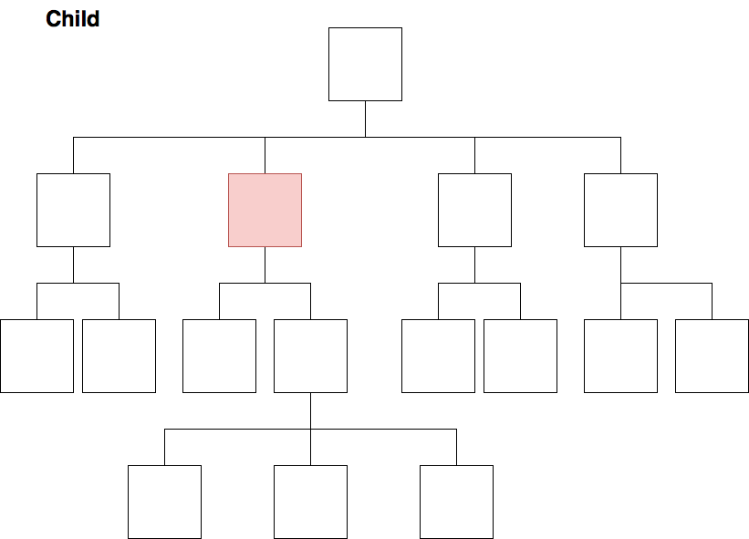

# Séance 6 : Aller plus loin dans la compréhension des imbrications XML

---
## Construire des arbres TEI

[Mon rêve familier](img/Mon_reve_familier.png)
[Le Misanthrope](img/Misanthrope.png)
[Le Cid](img/LeCid.png)

---
## Initiation à Xpath
 

* Xpath 2.0 est publié par le *World Wide Web Consortium* (W3C) et s’inscrit dans la famille des standards XML;

* Xpath est un langage de requêtes qui permet de parcourir un arbre XML;

* Xpath a été conçu comme un langage intégré, et non pas un langage autonome; 
	
* **Attention** : Xpath est un « read-only » langage. 

 

Pour aller plus loin : Michael R. Kay, *XPath 2.0 programmer’s reference*, Indianapolis, IN, Wrox Press, 2004. p.1-5.

---
### La syntaxe Xpath
 
 
Une expression de chemin correspond à une séquence d’étapes séparées par l’opérateur « / ». 
Sans indication particulière la relation se fait d’un élément parent vers un élément enfant.
 
 
Pour en savoir plus : 
Michael R. Kay, XPath 2.0 programmer’s reference, Indianapolis, IN, Wrox Press, 2004, p.215-216. 

---

#### Exercice de repérage (1)

* Mon rêve familier 
	* Donner le chemin de la racine TEI vers les vers d’un quatrain;
	* Donner le chemin de la racine TEI vers le titre;
* Le Misanthrope
	* Donner le chemin de la racine TEI vers les vers d’une scène;
	* Donner le chemin de la racine TEI vers la déclaration d’un personnage;
* Le Cid
	* Donner le chemin de la racine TEI vers la déclaration d’un nom de personnage dans la liste des personnages de la préface;
	* Donner le chemin de la racine TEI vers les vers de la pièce.

---

Xpath possède plusieurs axes de relation :

* ancestor : `ancestor::node()`
* ancestor-or-self : `ancestor-or-self::node()`
* parent : `parent::node()`
* descendant : `descendant::node()`
* descendant-or-self : `descendant-or-self::node()`
* child : `child::node()` ou `node()`
* following : `following::element`
* following-sibling  : `following-sibling::node()`
* preceding :`preceding::node()`
* preceding-sibling : `preceding-sibling::node()`
* self : `self::node()` ou `.`
* attribute : `attribute::node()`
---

---

---

#### Exercice de repérage (2)

* Mon rêve familier 
	* Donner le chemin le plus court de la racine TEI vers les vers d’un quatrain;
* Le Misanthrope
	* Donner le chemin le plus court depuis un vers vers le nom du personnage qui parle;
	* Donner le chemin le plus court depuis les vers d’une scène vers le titre de la scène;
* Le Cid
	* Donner le chemin le court de la racine TEI vers un des paragraphes de la préface.

---

Pour affiner sa requête Xpath, on peut ajouter des **prédicats**. 
Le prédicat est noté entre crochets droits après l'élément auquel il se rapporte. 
On peut ainsi spécifier la position d'un élément, une relation d'un élément avec un autre élément, le nom ou la valeur de l'un de ses attributs.

Exemples : 

* `lg[attribute::type='sizain']`;
* `lg[attribute::type='quatrain'][position()=1]` ou `lg[attribute::type='quatrain'][1]`;
* `lg[attribute::type='quatrain']/l[last()]`.

---

#### Exercice de repérage (3)

* Mon rêve familier 
	* Donner le chemin le plus rapide de la racine TEI vers le vers n°2 du premier quatrain;
* Le Misanthrope
	* Donner le chemin le plus rapide de la racine TEI vers le nom du locuteur de la troisième réplique de l'acte I, scène 1;
* Le Cid
	* Donner le chemin le rapide de la racine TEI vers le nom du deuxième personnage de la liste des personnages déclarée dans la préface.
		* Récupérer la chaîne de caractères contenue dans la balise `<role>`.

---
#### Quelques abréviations

* descendant : `//`
* child : `node()`
* self :  `.`
* attribute : `@`

---
#### Exercice

*Écrire les chemins de l'exercice de repérage n°3 avec des abréviations*

* Mon rêve familier 
	* Donner le chemin le plus rapide de la racine TEI vers le vers n°2 du premier quatrain;
* Le Misanthrope
	* Donner le chemin le plus rapide de la racine TEI vers le nom du locuteur de la troisième réplique de l'acte I, scène 1;
* Le Cid
	* Donner le chemin le rapide de la racine TEI vers le nom du deuxième personnage de la liste des personnages déclarée dans la préface.

---
#### Traduire les expressions suivantes :  

* `//figure`
* `//book[@category=’fiction’]`
* `//*/*`
* `//book/title`
* `chapter//footnote`
* `.//footnote`

----

#### ATTENTION : 
`<chapter//diagram[1]>`!= `<chapter/descendant::diagram)[1]>`, pourquoi ?

		<chapter>
                <section>
                    <diagram nr=12>
                    <diagram nr=13>
                </section>
                <section>
                    <diagram nr=14>
                    <diagram nr=15>
                </section>
                <section>
                    <diagram nr=16>
                </section>
		</chapter>

Pour aller plus loin : https://www.w3schools.com/xml/xpath_intro.asp 
